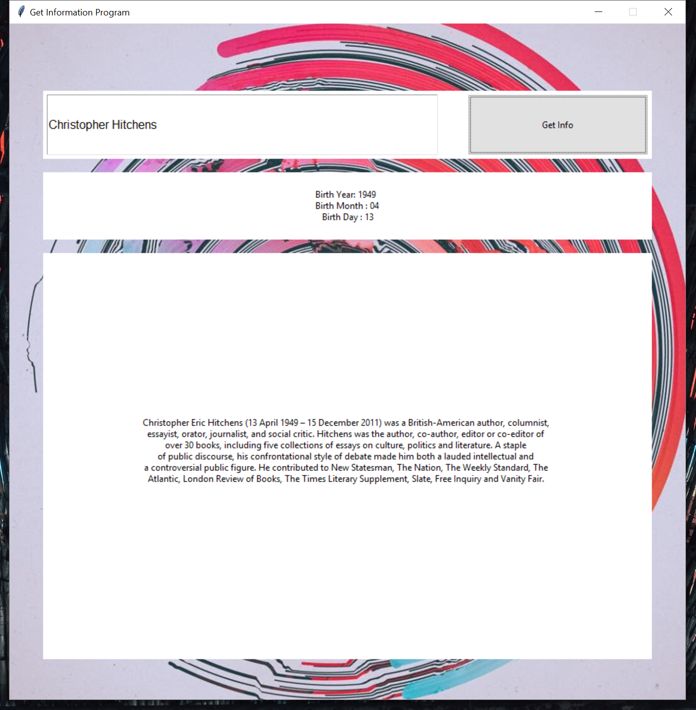

# Getting Wiki Info

It's a simple program I built on Python that generates customized URL based on user input, webscrapes information from the person's wikipedia page, and returns the formatted information. 

## Getting Started

Make sure that you have the required dependencies mentioned below installed in your setup, download the repository and run the getwikiinfo.py script. 

### Installing Dependencies

You will need three libraries - tkinter (to build the GUI), requests (to send in HTTP requests), and Beautiful Soup (to parse the html file).

Tkinter comes with Python by defaults

You can pip install the other two. 
```
pip install requests
```
```
pip install beautifulsoup4
```

## Running the tests

Simply run the getwikiinfo.py script. You will be prompted with a simple interface. Type somebody's name (basically anyone who has a wikipedia page). Ideally, it's better to type the first letter of each word of the name in caps because some URLs are not case-insensitive. 




## Built With

* [Tkinter](https://wiki.python.org/moin/TkInter) - GUI package
* [Beautiful Soup](https://www.crummy.com/software/BeautifulSoup/bs4/doc/) - parsing the HTML file


## Authors

* **Amitabha Dey** Comp Sci graduate from BRAC University. I dabble in Python. 

## License

Licensees may copy, distribute, display, and perform the work and make derivative works and remixes based on it only for non-commercial purposes.

